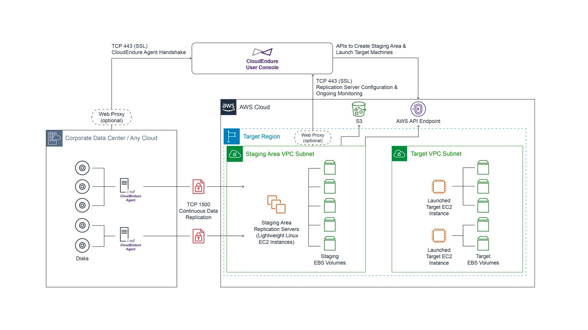
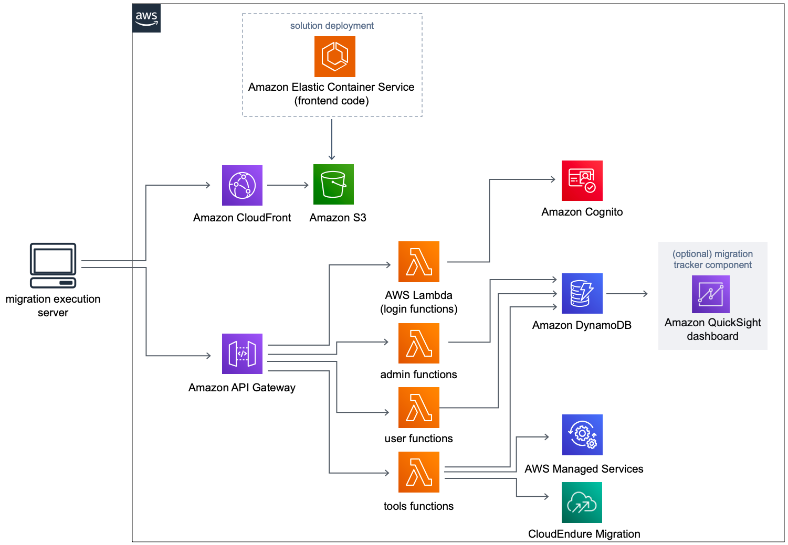
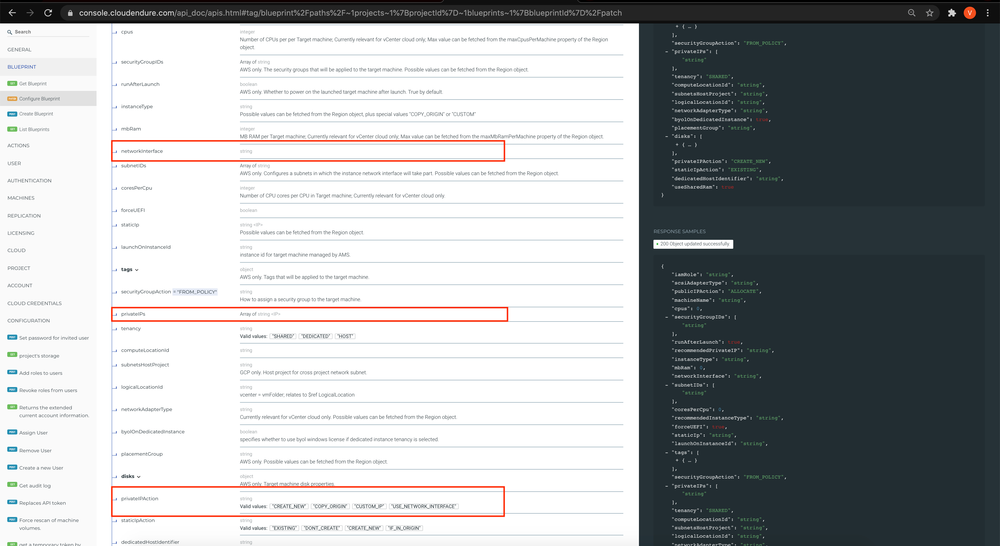
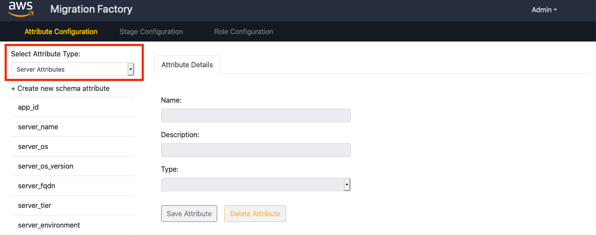
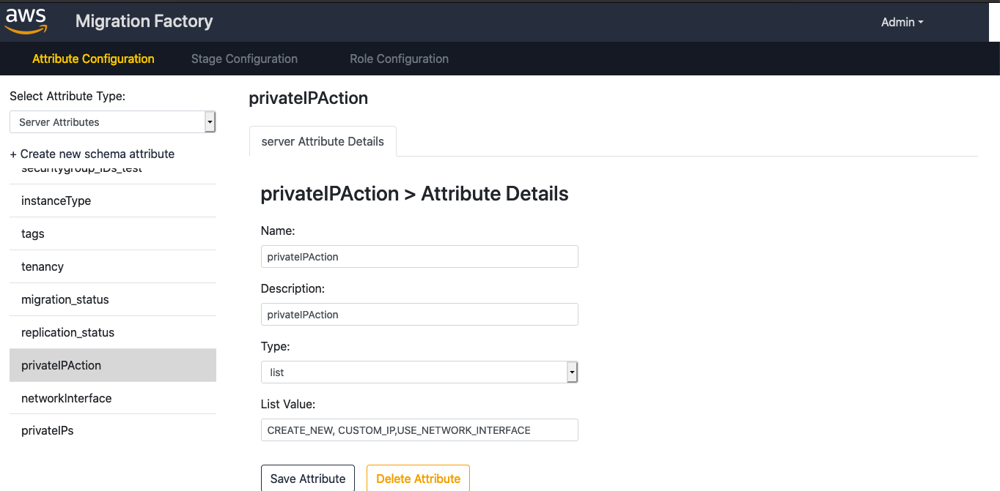
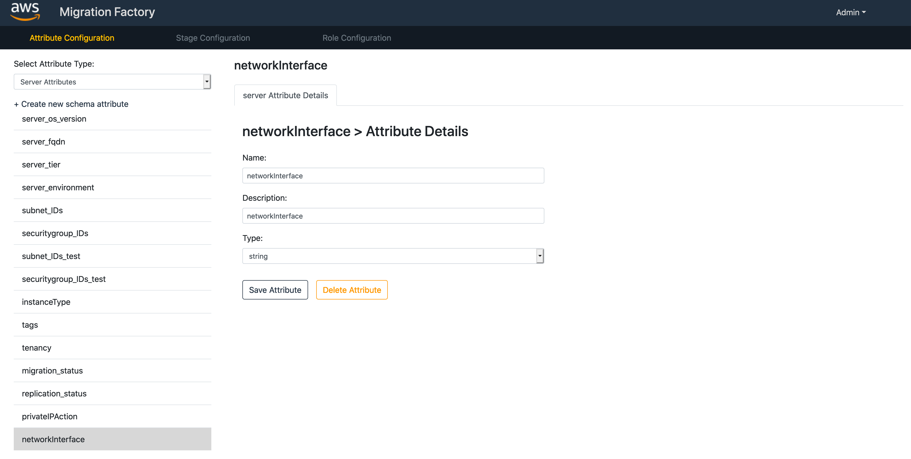
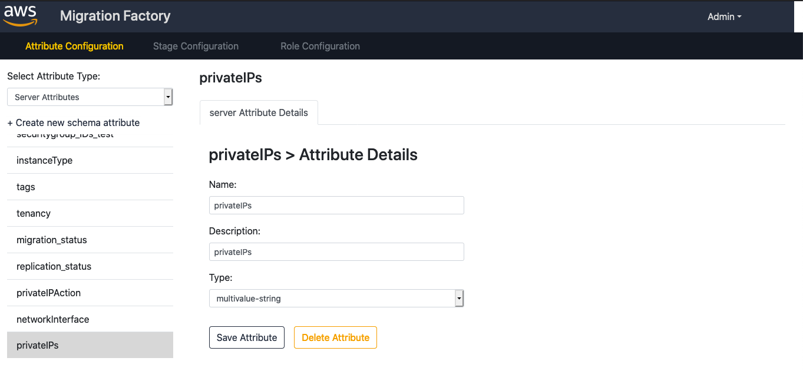
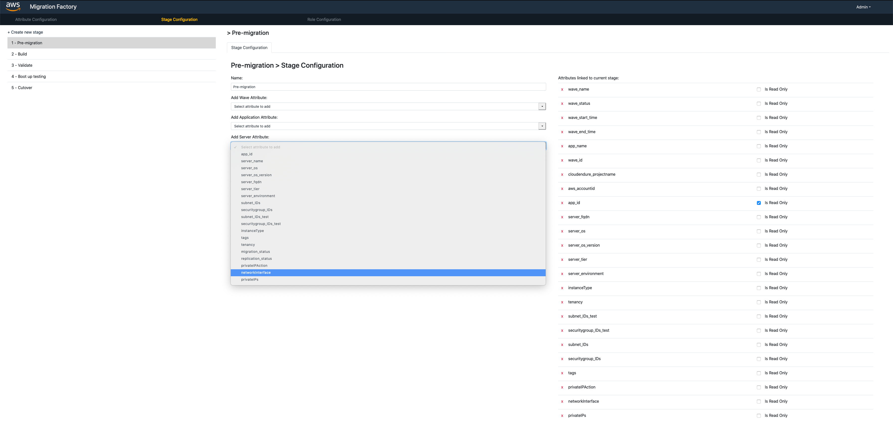
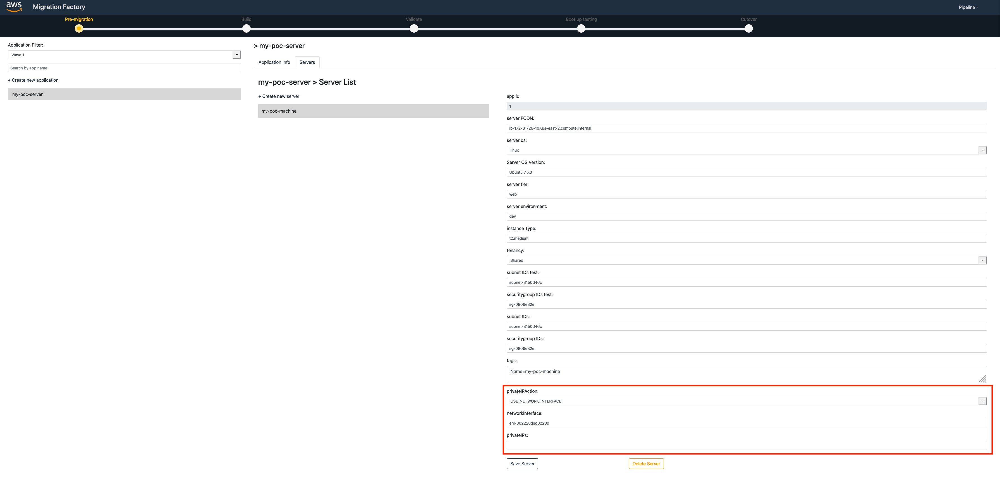
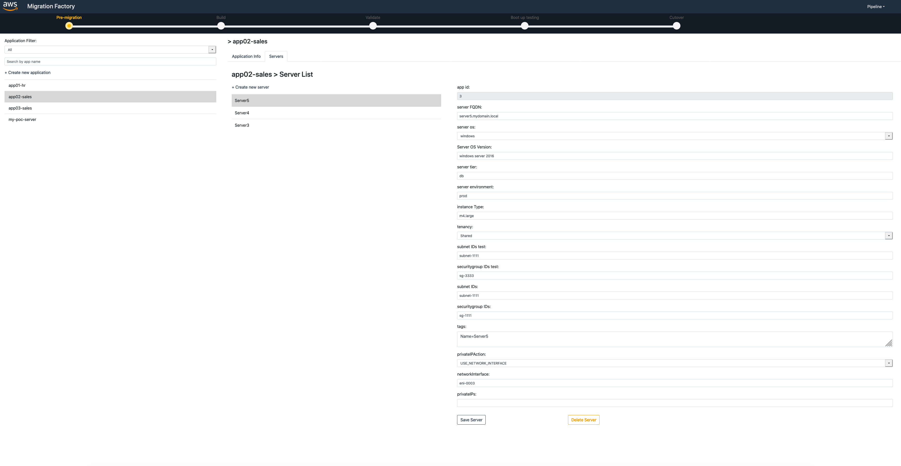

# Rehost Migration Accelerator : Customize CEMF to support ENI / Private IPs as part of the blueprint updation

## Summary
CloudEndure Migration Factory (CEMF) is an orchestration platform powered by CloudEndure for rehosting servers to AWS at scale with a factory like approach. It helps customers with their medium-scale to large-scale migrations by automating manual processes, which are often slow or complex to scale. The factory consists of a server-less web application (deployed into your account using [AWS CloudFormation](https://aws.amazon.com/cloudformation/)) and execution scripts. Once the factory is deployed, you simply import your migration data (i.e. information about your source servers grouped into [migration waves](https://docs.aws.amazon.com/prescriptive-guidance/latest/migration-portfolio-discovery/planning.html)), and then orchestrate the processes using the CEMF execution scripts. Progress on all migrations can then be monitored inside the web portal.


An elastic network interface is a logical networking component in a VPC that represents a virtual network card. It can include the following attributes:

- A primary private IPv4 address from the IPv4 address range of your VPC
- One or more secondary private IPv4 addresses from the IPv4 address range of your VPC
- One Elastic IP address (IPv4) per private IPv4 address
- One public IPv4 address
- One or more IPv6 addresses
- One or more security groups
- A MAC address
- A source/destination check flag
- A description


This pattern talks about how you can customise the CEMF to support ENI/Private IP as part of the blueprint. This would help customers who are looking for large scale migrations with pre-planned Private IPs. You can create and configure network interfaces in your account and attach them to instances in your VPC. For example, some customers might require a private IPs to be reserved for an instance even before the cutover. In such cases, its advisable to create an ENI with a pre-defined private IP, such that same ENI could be used during the final cutover of the instance. This AWS resource is referred to as a network interface in the AWS Management Console and the Amazon EC2 API. Therefore, we use "network interface" in this documentation instead of "elastic network interface". 

## Prerequisites and limitations
### Prerequisites 
- Active AWS Account
- Deployed Cloud Endure Migration Factory Solution
- Active account in Cloud Endure
- FactoryEndpoints.json is updated with Cloud Endure Migration Factory LoginApiUrl and UserApiUrl ([Detailed Steps](https://docs.aws.amazon.com/solutions/latest/aws-cloudendure-migration-factory-solution/deployment.html) : Navigate to "Update the Configuration File")
- Intake data is loaded into Cloud Endure Migration Factory for multiple applications ([Detailed Steps](https://docs.aws.amazon.com/prescriptive-guidance/latest/migration-factory-cloudendure/step1.html))

### Limitations
- This pattern talks about adding ENI support to the CEMF blueprint. However, If you are looking for adding any other CloudEndure supported field as part of the blueprint, still you can follow the same approach listed in this pattern.
- **Copy Source** option (Source IP) is not in scope of this pattern.

### Product Versions
- Python : 3.8.2
- aws-cli : 2.1.30
- CloudEndure Migration Factory Solution : 1.0

## Architecture
### Cloud Endure Migration Factory Solution Overview


### Cloud Endure Migration Factory Solution Architecture


## Automation and scale
Many companies today want to migrate their servers to Amazon Web Services (AWS) as quickly as possible. This is not an easy job, especially if you want to migrate thousands of servers in a short period of time, such as 6–12 months. Hence planning becomes a crucial part in any mass migrations.

For instance, consider a single server which needs to be migrated from your on premise datacenter to AWS. As a pre-requisite, you need to have a static private IP reserved for it in advance, such that the application and network team could do some of their home work before the cutover. In this case, you need to find an unused IP from the console and then create an ENI and use that ENI instance for test cutover and final cutover. This might take you around 10 minutes of your time, just for doing the preparations.

Now assume, you have 100 such servers to be migrated with a pre-planned Private IP or ENI. It could easily take up around 16 hours. This is where the automation comes into picture. All you have to do is to deploy the ENIs using the CloudFormation templates, the then update these ENIs in the CEMF intake form and import into CEMF. Now its just a matter of minutes to do the test cutover and final cutover for these 100 servers. Now you have a pre-planned blueprint, which you could use to test any number of times.

## Tools
[AWS CloudEndure Migration Factory Solution](https://aws.amazon.com/solutions/implementations/aws-cloudendure-migration-factory-solution/#)

Migration Factory solution coordinates and automates large scale migrations to the AWS Cloud, involving numerous servers. Enterprises can improve performance and prevent long cutover windows by automating manual processes and integrating multiple tools efficiently.

[CloudEndure Migration](https://console.cloudendure.com/#/signIn)

CloudEndure Migration is an automated rehost (lift-and-shift) solution for migrating workloads to AWS.

**Benefits**

- Migrate from any source infrastructure (physical, virtual, cloud)
- Designed for enterprise workloads such as SQL Server, Oracle, and SAP
- Non-disruptive testing
- Cutover of minutes

[AWS CLI](https://docs.aws.amazon.com/cli/latest/userguide/install-cliv2.html)

The AWS Command Line Interface (AWS CLI) is an open source tool that enables you to interact with AWS services using commands in your command-line shell. With minimal configuration, the AWS CLI enables you to start running commands that implement functionality equivalent to that provided by the browser-based AWS Management Console from the command prompt in your terminal programs.

## Code

### Download the sample automation scripts
1. Sign in to the migration execution server and download the sample automation scripts from the [GitHub repository](https://github.com/awslabs/aws-cloudendure-migration-factory-solution/blob/master/source/automation-scripts.zip).
2. Unzip the sample automation scripts file and copy all the files to the scripts folder in the Migration Execution server. (eg: ``c:\migrations\scripts``)
3. Download this customised code which contains the updates required to support ENI/Custom Private IP as part of the CEMF blueprint. Code contains the below files:


|File Name                      |Description                    |
| ------------------------------|:-----------------------------:|
|0-Import-intake-form.py	    |This is the updated CEMF automation script which is used to capture the wave details from the intake form csv. This script would support the newly added fields like privateIPAction, networkInterface, privateIPs.|
|0-Migration-intake-form.csv	|csv file which is used as an wave intake form by 0-Import-intake-form.py script. This csv could be used as a reference for adding the new fields like privateIPAction, networkInterface, privateIPs during the wave planning. As of now, it contains dummy data, which could be replaced with your actual wave plan.|
|FactoryEndpoints.json	        |The script 0-Import-intake-form.py connects to CEMF and authenticates using the ``LoginApiUrl`` and ``UserApiUrl`` present in this file. Hence, before running the script, you should take care of updating this file with the actual value of your CEMF's respective ``LoginApiUrl`` and ``UserApiUrl``|
|UpdateBlueprint.py	            |This is the script used by the ``migration-factory-test-cloudendure`` lambda function which is responsible for updating the CloudEndure blueprint, using the values passed from CEMF.|

### Deploying the Code Changes
1. Replace the ``0-Import-intake-form.py`` in the sample automation scripts folder (eg: ``c\migration\scripts``) which you downloaded in above step 1 with the one present in this pattern.
2. You can refer to ``0-Migration-intake-form.csv`` to create your new intake form csv file.
3. Go to the account/region wherein you have deployed CEMF and find the lambda function named ``migration-factory-test-cloudendure``. (In case you had deployed CEMF CloudFormation stacks in us-east-1, this would be your lambda function: https://console.aws.amazon.com/lambda/home?region=us-east-1#/functions/migration-factory-test-cloudendure?tab=code)
4. Copy the contents of ``UpdateBlueprint.py`` file which you downloaded as part of the customized code in step 3 above and paste it into the above lambda function and click on **Deploy**
5. In case you havent updated the CEMF schema to support these new fields, then please do so by following the steps mentioned in the "Schema Updation" section.
6. Now the changes required for the ENI/ Private IP is completed. 

## Related Resources
### Schema Updation

Let us see how we can update the CloudEndure Migration Factory solution to accept Private IP or ENI as one of the input to the blueprint.

_PS: Even though the steps mentioned below takes updation of Private IP or ENI into consideration, same steps could be followed for including any other CloudEndure supported fields in CEMF blueprint._

#### Steps
1. Identify the attribute you need to support in CEMF. In this case, it would be ENI / Private IPs

2. Refer the [CloudEndure API documentation](https://console.cloudendure.com/api_doc/apis.html#tag/blueprint%2Fpaths%2F~1projects~1%7BprojectId%7D~1blueprints~1%7BblueprintId%7D%2Fpatch) to find the additional details of the fields which needs to be passed from CEMF.

3. You would be able to find the details of the fields to be updated

    - **privateIPAction** can have any one value from the supported list. Supported values are "CREATE_NEW", "CUSTOM_IP","USE_NETWORK_INTERFACE"

    - **networkInterface** wherein you need to provide the ENI. (When privateIPAction is selected as USE_NETWORK_INTERFACE)

    - **privateIPs** wherein you can provide a list of private IPs as comma separated. (When privateIPAction is selected as CUSTOM_IP)
      
      

4. Since these parameters are specific to a server, we need to update the server attributes, such that it would get reflected in the blueprint for server. Hence we need to update factory schema. Inorder to update the factory schema, go to Admin page of CEMF and select Server Attributes from the dropdown and click on Create new schema attribute.
   
    **Admin -> Attribute configuration -> Select Attribute Type -> Server Attributes -> Create new schema attribute**
   
   

5. Now you need to add the 3 attributes as we saw in the CloudEndure API in step 3. viz privateIPAction, networkInterface and privateIPs. Make sure to add them as shown below and click on **Save Attribute**
   
   
   
   

6. Now we need to link these 3 (privateIPAction, networkInterface and privateIPs) parameters to the Pre-migration stage, so that, it would go in as part of the Update blueprint call to CloudEndure. 

    **Click on Stage Configuration -> 1 - Pre-migration -> Add Server Attribute**
   

   Once both are added, you would be able to see them under the **Attributes linked to current stage** section on the right. Click on **Save Stage**  to save the changes.

7. Now you may go back to the Pipelines and select the respective wave and check for the Server details. You can see that the newly added fields are made available as part of the blue print.
   
   
## References
1. [Migrating workload to the AWS Cloud using CloudEndure Migration](https://docs.aws.amazon.com/prescriptive-guidance/latest/migration-cloudendure/welcome.html)

2. [Accelerating large-scale migrations to AWS with CloudEndure Migration Factory](https://aws.amazon.com/blogs/mt/accelerating-large-scale-migrations-to-aws-with-cloudendure-migration-factory/)

3. [AWS CloudEndure Migration Factory Solution](https://aws.amazon.com/solutions/implementations/aws-cloudendure-migration-factory-solution/)

4. [How to get started with CEMF](https://docs.aws.amazon.com/prescriptive-guidance/latest/migration-factory-cloudendure/getting-started.html)

5. [CloudEndure - Understanding the Migration Solution](https://docs.cloudendure.com/#Introduction/Introduction.htm)

6. [Automating large-scale server migrations with CloudEndure Migration Factory (Guide)](https://docs.aws.amazon.com/prescriptive-guidance/latest/migration-factory-cloudendure/welcome.html)

## Additional Information
### Running the script : customized intake form

1. Go to the folder ``c\migration\scripts`` and run the script as below. Sample intake form has been attached in the shared code already.

```shell
C:\migrations\scripts> python 0-Import-intake-form.py --Intakeform "0-Migration-intake-form.csv"
****************************
*Login to Migration factory*
****************************
Factory Username: user@amazon.com
Factory Password: 
Migration Factory : You have successfully logged in
****************************
*Reading intake form List*
****************************
Intake form data loaded for processing....
*********************************************
*Creating resources in the migration factory*
*********************************************
New Apps: 
app01-hr
app02-sales
app03-sales

App app01-hr created in the migration factory
App app02-sales created in the migration factory
App app03-sales created in the migration factory
----------------------------------------
New Servers: 
Server1
Server2
Server3
Server4
Server5
Server6
Server7
Server8

Server Server1 created in the migration factory
Server Server2 created in the migration factory
Server Server3 created in the migration factory
Server Server4 created in the migration factory
Server Server5 created in the migration factory
Server Server6 created in the migration factory
Server Server7 created in the migration factory
Server Server8 created in the migration factory
```
2. Now you can go to the CEMF UI and validate the same. 



3. You can use all other CEMF features like test cutover and cutover as usual.