# ExcelToMigration Factory Script Documentation

## Problem it solves: Automate process converting data from a Excel Spreadsheet to Migration Factory preventing human errors and saving hours of repetitive manual work

### As part of a migration process, companies will provide to migration team data about servers to migrate. Very often this list will be provide on a excel format.

### Migration factory import CSV that needs to follow some specific requirements.

### This script automatically extract data from any excel file and populate Migration factory with servers blueprint and tags.

### You don’t need to have one spreadsheet only for Migration Factory. No copy and paste required, No conversion to CSV file for each blueprint / tags updates.

Additional features:
- Servers in multiple rows on excel file that contain muliple applications will be automatically combined
- All duplicates servers rows will be checked for consistency on required fields. Example. If one rows the server is marked to migrate to subnet-xxxxxxxxxxx and the same server in another row, for another application, is marked to migrate to subnet-yyyyyyyyy, the script will stop with a message that data does not match. User can check what the correct information is, fix it and run the script again.
- “,” will be converted to “ / ” 
- TAG’s that are different for the same server (different row / different application)will be appended

## Configuration File

First step is edit the file 0-ConfigExcelToMigrationFactory.json

you need to edit this file with information about the excel file:
Excel_tab_name: type the name of the excel file tab that contain data 
Row_With_Field_Names: type the row number that contain the headers of your spreadsheet
All other items should be edit with the column name of the required data.
On your excel file all tags should be in sequence. example: from column A to column AL. You only need to provide the name of the first column and last column that contain TAGs (EC2 and Volumes will be populated with these Tags)

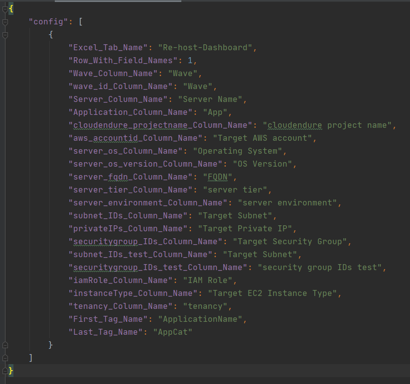

Excel file can have other columns that will not be used by Migration Factory.
In the example below. Only the columns with Yellow background are being used by migration factory
be sure that there are not blank fields. It is a requirement that all data should be provided from the spreadsheet. For example: script will reject if the server name is blank

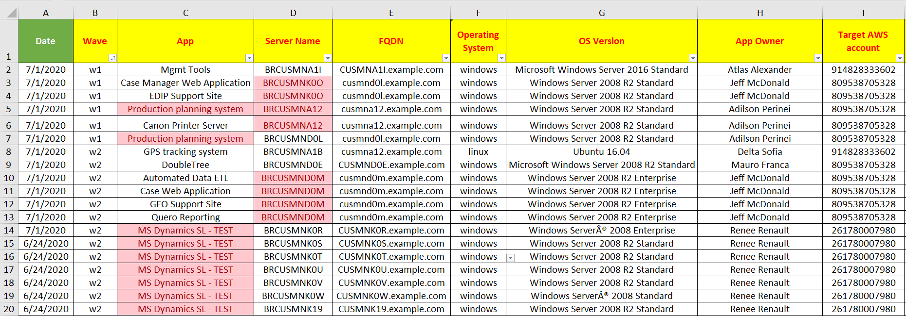

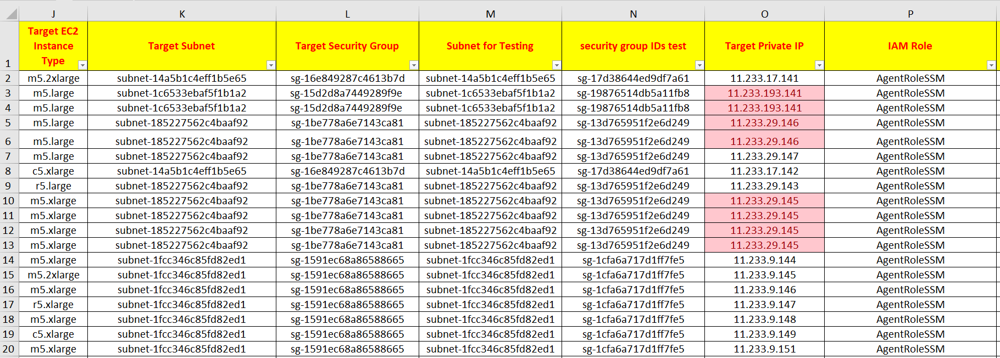

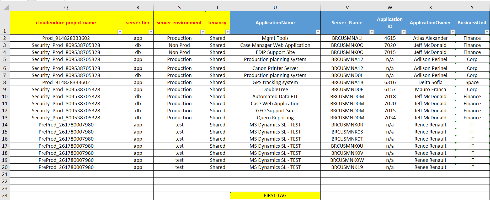

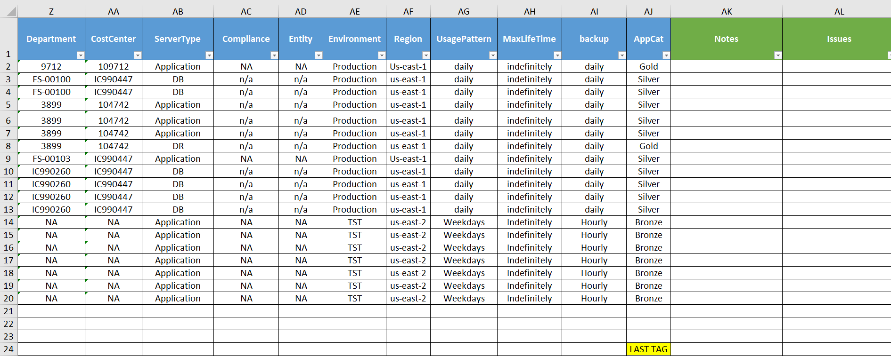

## Running the script 

### Requirements to run the script locally:

xlrd library (handle excel files) is required in addition to the migration factory scripts libraries (requests)
0-Import-intake-form.py
0-import-tags.py
FactoryEndpoints.json (Information to populate this configuration file can be found on CloudFormation Outputs Tab

### Requirements to run the scprint on Migration Factory Execution Server:

Python xlrd library (handle excel files)

Script can run from Migration Factory Execution Server or local machines. For local machine it is necessary to copy FactoryEndpoints.json from Migration Factory Execution Server to the same directory where you are going to run the script. 0-import-intake-form.py and 0-import-tags-py are also required to be on the same directory.

> python 0-ExcelToMigrationFactory.py -i <pathToExcelFile/FileName>

<-i> is a required argument: path and file name of the excel file

Enter the Wave:
Wave is the column used to filter the servers that you want to feed migration factory.

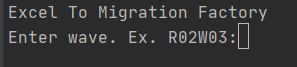

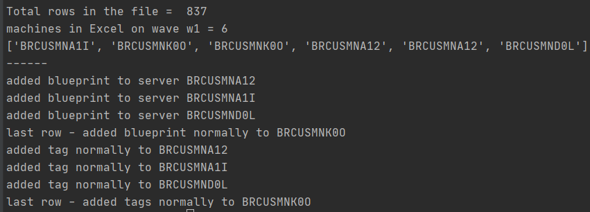

If no error is found you will be prompt to enter Y or N for Blueprint update

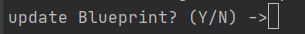

Enter you migration factory credentials

Blueprint will be upload to Migration Factory

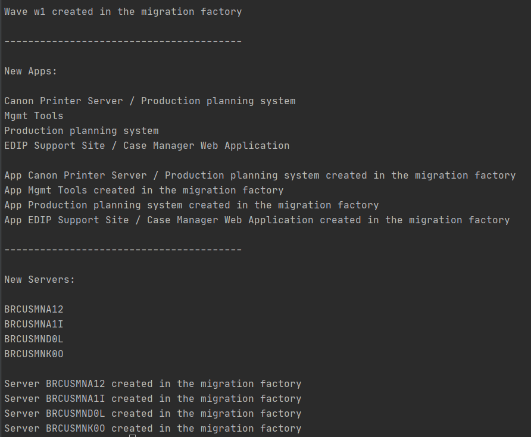

Next you will be prompt to answer if you also want to update the TAGs

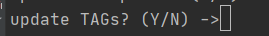

Enter you Migration Factory credentials.

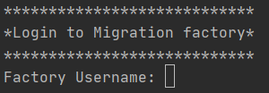

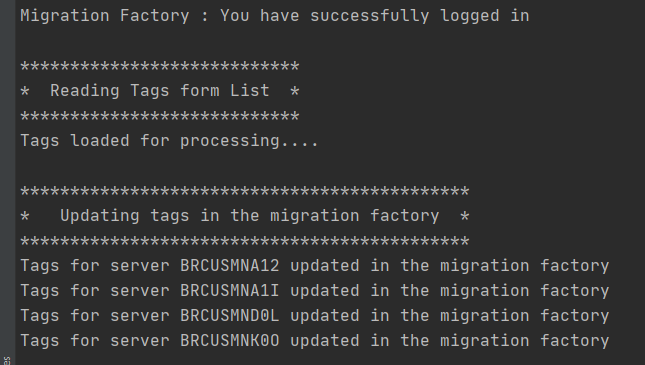

All done. You are ready to login to Migration Factory console and start migration!
