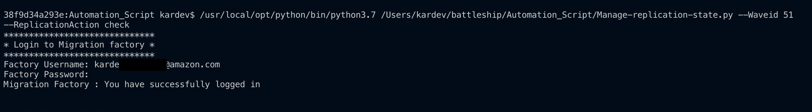
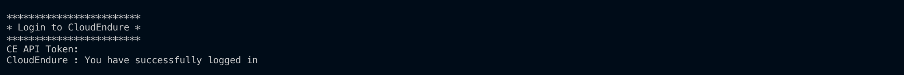
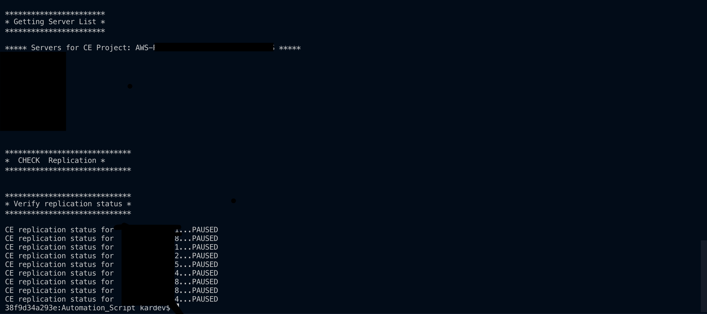

# AWS Migration Automation Library
AWS Migration Automation Library is an collection of tools and automation scripts to automate and acclerate AWS migrations, we encourage everyone in AWS to contribute and share.

## Manage CE Replication State 
This automation script will help you manage the replication state for any CEMF wave. The CloudEndure replication can be started,stopped,Paused and validated using this script. 


## Usage


**1.** Login to the migration execution server as an administrator, open a command prompt (CMD.exe).

**2.** Copy the file Manage-replication-state.py to the migration execution folder **c:\Migrations\Scripts** and run the following Python command.
```cmd
python3 Manage-replication-state.py --Waveid <<CEMF_WAVE_ID_HERE>> --ReplicationAction <<Replication_Action_Value_Here_Can_be start,stop,pause,check>>
```
Replace <<CEMF_WAVE_ID_HERE> with the appropriate Wave ID value to manage the CE replication state
Replace <<Replication_Action_Value_Here_Can_be start,stop,pause,check>> with the replication action, It can be start,stop,pause,check


**3.** Log in to the CEMF solution with your username and password. 




**2.** Provide the CloudEndure API Token when prompted



💡 You will see the output with the requested replication state action



Copyright 2020 Amazon.com, Inc. or its affiliates. All Rights Reserved.

Licensed under the the MIT-0 License. See the LICENSE file.
This file is distributed on an "AS IS" BASIS, WITHOUT WARRANTIES OR CONDITIONS OF ANY KIND, express or implied. See the License for the specific language governing permissions and limitations under the License.
