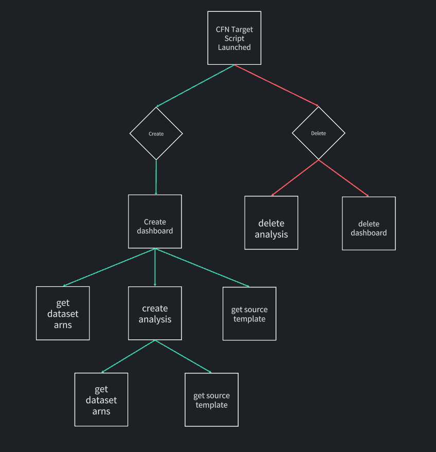

# Using CloudFormation Custom Resources to share Quicksight Dashboards and Analysis between accounts

# Introduction:

This automation script is made with to make copying dashboards and analysis from one account to the other easier. This uses CloudFormation to do all the tasks you need in order to successfully migrate your QS dashboard from one account to the other.

## Architecture:


## Flow diagram:

SOURCE FLOW:


TARGET FLOW:



## Assumptions:

1. Quicksight has been set up and configured ie. past the setting up page.
2. The dataset to be used has already been loaded to Quicksight.
   - If you have custom columns/headers that's not a part of your original dataset, make sure you have created that in your target dataset before running this script.
3. Your S3 buckets/datasets isn't encrypted. IF IT IS, make sure to edit the role permissions to allow this lambda and QS to access those keys.

## File Structure:

- `./source_cfn.yaml` - The CloudFormation template that creates a dashboard template in your source account. This needs the existing dashboard name, new dashboard name, target account number, and source function name parameters.
- `./target_cfn.yaml` - The CloudFormation template that creates a dashboard and analysis in your target account. This needs the source template name, source account number, desired dashboard name, and the username of the dashboard owner parameters.
- `./img/*` - contains all the diagrams you can find linked to this readme.
- `./bootstrap/source_setup.yaml` - the CloudFormation template that will deploy the lambda used by the source_cfn to create the template. This should be deployed first in the source account.
- `./bootstrap/source-main.zip` - this is the zipped file that contains the lambda function. This should be uploaded to your source s3 bucket to be referenced by the source_setup.yaml.
- `./bootstrap/target_setup.yaml` - the CloudFormation template that will deploy the lambda used by the target_cfn to create the dashboard and analysis. This should be deployed first in the target account.
- `./bootstrap/target-main.zip` - this is the zipped file that contains the lambda function. This should be uploaded to your target s3 bucket to be referenced by the target_setup.yaml.
- `./source/main.py` - this is the main lambda function in your SOURCE ACCOUNT that is responsible for gathering all the necessary data to create a template from your source account.
- `./target/main.py` - this is the main lambda function in your TARGET ACCOUNT that is responsible for pulling the template from your source account, creating a dashboard, and creating an analysis in your target account.

## Deployment Steps:

1. (Create an S3 bucket) and upload the zip files located in the `./bootstrap/` folder in your source and target account. Make sure to only upload the zip necessary for that account. For example, in the source account, only upload the `source_main.zip` to your bucket.
2. Deploy the cloudformation templates on your source and target accounts. These templates will setup Lambda and the required permissions in order for Lambda to run.

   ```
   SOURCE ACCOUNT - ./bootstrap/source_setup.yaml
   TARGET ACCOUNT - ./bootstrap/target_setup.yaml
   ```

3. Grab the necessary information you need for the CloudFormation to work:

   - SOURCE ACCOUNT DEPLOYMENT:
     - Target account ID
     - Dashboard Name of the dashboard you are trying to copy
     - New name for the template you are going to be creating
   - TARGET ACCOUNT:
     - Source Account ID

4. Deploy the `source_cfn.yaml` in your SOURCE ACCOUNT.

5. Deploy the `target_cfn.yaml` in your TARGET ACCOUNT.

## Current Limitations:

### As of now this will fully work if you only have 1 dataset. If you have multiple datasets do the following:

1. Go to `./source/main_src.py` and edit the `create_template` function on line 198 and add your dataset. Syntax should be something like this:

// existing dataset:

```

					{
						'DataSetPlaceholder': 'app_id,app_name,cloudendure_projectname,instancetype,IntMigrationStatusSummary,migration_status,MigrationStatusSummary,replication_status,server_environment,server_fqdn,server_id,server_name,server_os,wave_id',
						'DataSetArn': source_dataset_entity[0]
					}
```

// add datasets (in this example, we have 3 datasets in total):

```

					{
						'DataSetPlaceholder': 'app_id,app_name,cloudendure_projectname,instancetype,IntMigrationStatusSummary,migration_status,MigrationStatusSummary,replication_status,server_environment,server_fqdn,server_id,server_name,server_os,wave_id',
						'DataSetArn': source_dataset_entity[0]
					},
					{
						'DataSetPlaceholder': 'ENTER THE PLACEHOLDER FOR YOUR DATA HEADERS HERE',
						'DataSetArn': source_dataset_entity[1]
					},
					{
						'DataSetPlaceholder': 'ENTER THE PLACEHOLDER FOR YOUR DATA HEADERS HERE',
						'DataSetArn': source_dataset_entity[2]
					},
```

2. Save and run your script.

3. For the target account - do the same for `./target/main.py`
