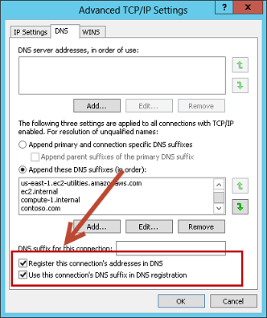
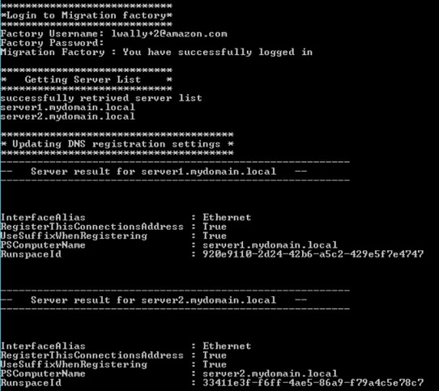

# AWS Migration Automation Library
AWS Migration Automation Library is an collection of tools and automation scripts to automate and acclerate AWS migrations, we encourage everyone in AWS to contribute and share.

## Update DNS dynamic registration on Windows
This automation script will help you enable two options on the network adapter as shown in the picture below 




## Usage


**1.** Login to the migration execution server as an administrator, open a command prompt (CMD.exe).

**2.** Copy the file CEMF-Update-Windows-DynamicDNS.py to the migration execution folder **c:\Migrations\Scripts** and run the following Python command.
```cmd
Python CEMF-Update-Windows-DynamicDNS.py --Waveid wave-id
```
Replace wave-id with the appropriate Wave ID value to update DNS settings

**3.** Log in to the CEMF solution with your username and password. You will see the following output





💡 RegisterThisConnectionsAddress and UseSuffixWhenRegistering return true means these two boxes are checked on the UI


Copyright 2019 Amazon.com, Inc. or its affiliates. All Rights Reserved.

Licensed under the the MIT-0 License. See the LICENSE file.
This file is distributed on an "AS IS" BASIS, WITHOUT WARRANTIES OR CONDITIONS OF ANY KIND, express or implied. See the License for the specific language governing permissions and limitations under the License.
