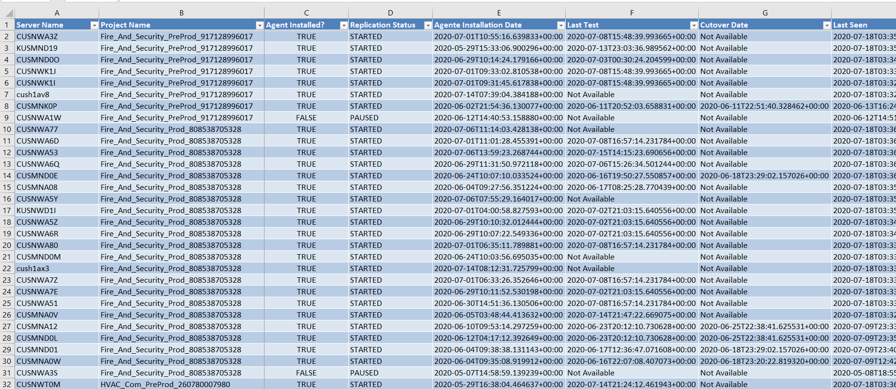

# Generates a CloudEndure Report for all Machines in Excel format.

## Problem it solves: Put information from all server from all projects in one location with auto filter ready.

Features:
- all machines pending for testing
- Server Name
- Project Name
- Cutover date and time
- Test date and time
- Replication status
- Backlog
- Total storage
- Replicated storage
- Agent installation date
- Date and Time of last communication between CloueEndure Agent and CloudEndure Console
- Last Consistent Data
- Estimated Time of the Next Conssitent Data
- Rescannerd Storage

## Running the script 

### Requirements to run the script:

import xlsxwriter (library that creates excel file .xlsx)

import requests (for authentication on CloudEndure)

run the command:
> python ce-report-to-excel.py

enter CloudEndure Username (email)

enter CloudEndure password

Excel file will be created on the same directory of the script using the format:
ce-report-Year-Month-Day_Hour_Minute_Second.xlsx

