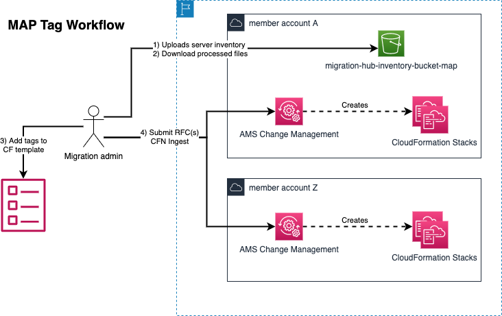

# AWS Managed Services - MAP 2.0 Automation Solutions
The work on this project is based on the solution in the [map tagging wiki](https://w.amazon.com/bin/view/AWS_Americas_Solution_Architecture_Team/ICAP/MigrationsAmbassadors/MAPTagging/). 

For customers that are using AWS Managed Services (AMS), we needed to customer the above solution to fit into the AMS change management process. This repo includes the modified code and detailed instruction guides to assist with installing the MAP 2.0 automation solution into an AMS environment.


There are three solutions that make up the MAP Automation Solution. At a minimum, it is recommended to use the CUR Automator and Originating IDs Automator. The Map Tagging Automator solution should only be considered if it is determined to be a good fit for the customer given the size of the customer's migraiton and their migration strategy.


## CUR Automator Solution
This is a one-time setup to set up the prerequisites for the MAP program. The solution automates the otherwise manual steps needed to create a CUR required for MAP 2.0.

## Originating IDs Automator Solution
This is a one-time setup. It enables a customer to simply upload their server inventory to S3, wait for the results, and then download the resulting files. Without this solution the customer would have to upload the inventory to AWS Migration Hub (currently not supported by AMS) and then manually download the files through the CLI using the Migration Hub API. 

This solution is optimized for a multi-account customer where a single account will be designated as the official source to determine MAP 2.0 originating ID values. 

This solution will generate the necessary MAP 2.0 Tags needed in order for the customer to then apply the tags to their AWS resources. Refer to the MAP 2.0 tagging guide for more information about using the AWS Migration Hub exported values to determine the tags and how to tag AWS resources.  

### How to use Originating IDs Automator Solution
1) Upload the server inventory csv file to the *migration-hub-inventory-bucket* in the *Upload-Your-Inventory-In-This-Folder*.
2) Monitor the *OutputFiles* folder, which will be populated with a datetimestamp folder with the output from AWS Migration Hub.

For more detailed information, see the information on the [instructions].(https://map-automation.s3-us-west-2.amazonaws.com/MAP-Tagging-Automator-Instructions.pdf)

The following workflow diagram shows how a typical migration admin would work with the Originating IDs Automator Solution to manually grab the output files and then apply them to CFN (or otherwise tag manually)


## MAP Tagging Automator
This is an optional solution that customers can choose to use in order to automatically tag their AWS resources as they are created. Without this solution, customer would have to manually determine the MAP 2.0 tag values for the given workload and then manually tag AWS resources with the appropriate tag value. 

This solution is a good fit for customers that are using CloudFormation Ingest to create resources within AMS. It works for all AMS Modes of operation (Standard, Dev-Mode, SSPS, and Customer-Managed) as long as you are provisioning the resources through CloudFormation. 

The MAP Tagging Automator supports CloudFormation to determine the tags for the AWS Resources based on a given appName. By including the appName as parameter value to CloudFormation, the solution will automatically query the AWS Migration Hub output files from the Originating IDs Automator solution and determine the appropriate MAP 2.0 tag values.

The following workflow diagram shows how a typical migration admin would work with the Tagging Automator Solution.


### How to use MAP Tagging Automator
There are 3 main sections that you have to include; parameters/mappings, the Lambda invocation, the tags from the Lambda output.  

#### **Parameters/Mappings**
You must have either parameters or mappings defined that contain the application name.

The example below defines two applications as a Mappings definition.
```yml
Mappings:
  MAP:
    Applications:
      Application1: TRACKAPP
      Application2: SOLARAPP
    
    ... etc ...
```

#### **Lambda invocation**  
The Lambda takes in the application name as parameter. It returns a set of MAP tags for the resource. Therefore, we have to have a separate Lambda invocation for each unique application name within the CFN.  

Note: For each Lambda invocation, be sure that the Logical ID is unique.

The example below shows two Lambda invocations that take in different application name parameters (building on the example above).
```yml
  LambdaGetMAPTagsServer1:
    Type: Custom::LambdaGetMAPTags
    Properties:
      ServiceToken: !ImportValue MAPMigration-TagLookupLambdaArn
      appName: !FindInMap 
        - MAP
        - Applications
        - Application1

  LambdaGetMAPTagsServer2:
    Type: Custom::LambdaGetMAPTags
    Properties:
      ServiceToken: !ImportValue MAPMigration-TagLookupLambdaArn
      appName: !FindInMap 
        - MAP
        - Applications
        - Application2
```


#### **Tags from Lambda output**
The Lambda is invoked and the parameters can be accessed by referencing the values from the Logical ID. 

The example below is a snippet from a LaunchTemplate and builds on the examples above. It uses the output of the two Lambda functions to set tags in the LaunchTemplate. 

*Server1 launch template snippet*  
```yml
  Server1LaunchTemplate:
    Type: AWS::EC2::LaunchTemplate
    Properties:
      LaunchTemplateData:
        TagSpecifications:
          - ResourceType: instance
            Tags:
              - Key: map-migrated
                Value: !GetAtt LambdaGetMAPTagsServer1.map-migrated
              - Key: map-migrated-app
                Value: !GetAtt LambdaGetMAPTagsServer1.map-migrated-app
          - ResourceType: volume
            Tags:
              - Key: map-migrated
                Value: !GetAtt LambdaGetMAPTagsServer1.map-migrated
              - Key: map-migrated-app
                Value: !GetAtt LambdaGetMAPTagsServer1.map-migrated-app

    ...etc...
```

*Server2 launch template snippet*  
```yml
  Server2LaunchTemplate:
    Type: AWS::EC2::LaunchTemplate
    Properties:
      LaunchTemplateData:
        TagSpecifications:
          - ResourceType: instance
            Tags:
              - Key: map-migrated
                Value: !GetAtt LambdaGetMAPTagsServer2.map-migrated
              - Key: map-migrated-app
                Value: !GetAtt LambdaGetMAPTagsServer2.map-migrated-app
          - ResourceType: volume
            Tags:
              - Key: map-migrated
                Value: !GetAtt LambdaGetMAPTagsServer2.map-migrated
              - Key: map-migrated-app
                Value: !GetAtt LambdaGetMAPTagsServer2.map-migrated-app

    ...etc...
```

## FAQ
**Q: What parameter do I provide to the Lambda function to look up the tags?**  
A: The parameter must be `appName` and the value must be a name of an Application that was specified by the customer in their server inventory xlsx file that was uploaded to the Server IDs automator S3 bucket.  

**Q: Why don't I see all the MAP 2.0 related tags when manually activating MAP 2.0 tags?**  
A: Wait at least 24 hours before activating MAP 2.0 tags as part of the CUR Automator solution.  

**Q: Why don't I see any new output files when uploading the server inventory to the Originating IDs Automator S3 bucket?**
A: Some things to check include:  
* Ensure the filename is lowercase alphanumeric with dashes.  
* Inspect the CloudWatch log for the Originating IDs Automator Lambda function  

**Q: What types of MAP 2.0 tags does this solution currently support?**  
A: The Server IDs Automator can generate all of the MAP 2.0 tags. The Tagging Automator solution currently only maps map-migrated and map-migrated-app tags.

## Appendix A - Complete CFN example
```yml
AWSTemplateFormatVersion: 2010-09-09
Description: An example ASG configuration for EC2 servers being created.

Parameters:
  appName:
    Type: String
    Default: SampleApp1
    Description: The name of the application. This name matches to one in the migrationHubAppFileName.
  InstanceSubnetId:
    Type: AWS::EC2::Subnet::Id
    Description: The subnet Id for the EC2 instance
  InstanceSecurityGroup:
    Type: AWS::EC2::SecurityGroup::Id
    Description: The security group Id for the EC2 instance
  InstanceType:
    Description: Sample EC2 instance type
    Type: String
    Default: t2.micro
    AllowedValues: [t2.nano, t2.micro, t2.small, t2.medium, t2.large, t2.xlarge, t2.2xlarge,
      t3.nano, t3.micro, t3.small, t3.medium, t3.large, t3.xlarge, t3.2xlarge,
      m4.large, m4.xlarge, m4.2xlarge, m4.4xlarge, m4.10xlarge,
      m5.large, m5.xlarge, m5.2xlarge, m5.4xlarge,
      c5.large, c5.xlarge, c5.2xlarge, c5.4xlarge, c5.9xlarge,
      g3.8xlarge,
      r5.large, r5.xlarge, r5.2xlarge, r5.4xlarge, 
      i3.xlarge, i3.2xlarge, i3.4xlarge, i3.8xlarge,
      d2.xlarge, d2.2xlarge, d2.4xlarge, d2.8xlarge]
    ConstraintDescription: must be a valid EC2 instance type.
  InstanceAmiId:
    Description: The AMI for the instance
    Type:  'AWS::SSM::Parameter::Value<AWS::EC2::Image::Id>'
    Default: '/aws/service/ami-amazon-linux-latest/amzn2-ami-hvm-x86_64-gp2'
  
Resources:
  LambdaGetMAPTags: # The Lambda function that will lookup the MAP tags using the provided appName.
    Type: Custom::LambdaGetMAPTags
    Properties:
      ServiceToken: !ImportValue MAPMigration-TagLookupLambdaArn
      appName: !Ref appName

  myASG:
    Type: AWS::AutoScaling::AutoScalingGroup
    Properties:
      VPCZoneIdentifier:
        - !Ref InstanceSubnetId
      LaunchTemplate: 
        LaunchTemplateId: !Ref mySimpleConfig
        Version: !GetAtt mySimpleConfig.LatestVersionNumber
      MinSize: '0'
      MaxSize: '1'
      DesiredCapacity: '1'
  
  mySimpleConfig:
    Type: AWS::EC2::LaunchTemplate
    Properties:
      LaunchTemplateName: !Sub SampleEC2s_${AWS::StackName}
      LaunchTemplateData:
          ImageId: !Ref InstanceAmiId
          InstanceType: !Ref InstanceType
          SecurityGroupIds: [!Ref InstanceSecurityGroup]
          TagSpecifications:
          - ResourceType: instance
            Tags:
            - Key: map-migrated
              Value: !GetAtt LambdaGetMAPTags.map-migrated
            - Key: map-migrated-app
              Value: !GetAtt LambdaGetMAPTags.map-migrated-app
          - ResourceType: volume
            Tags:
            - Key: map-migrated
              Value: !GetAtt LambdaGetMAPTags.map-migrated
            - Key: map-migrated-app
              Value: !GetAtt LambdaGetMAPTags.map-migrated-app

```