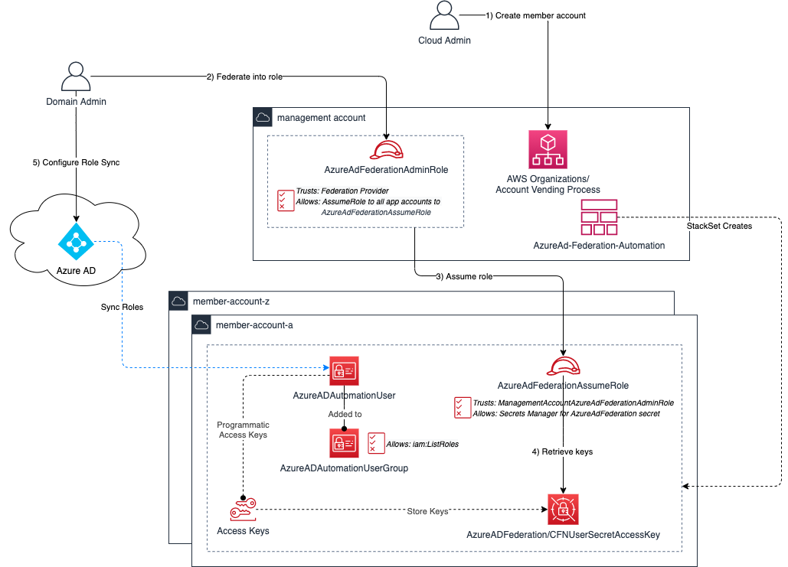

## Overview
This solution will enable the Azure AD administrator to obtain the necessary IAM User secret values themselves after a new account has been created.

A diagram of the workflow is included below.

## Workflow
1) After an account has been created, the Azure AD admin can federate into the master account using a specific role named **AzureAdFederationAdminRole**.

2) The user will now *switch roles* from the console to the new account using the role name **AzureAdFederationAssumeRole** and the ID of the new AWS account.

3) The user will navigate to AWS Secrets Manager to obtain the user secret keys in the setting named **AzureADFederation/CFNUserSecretAccessKey**

4) The user will then apply the secrets within Azure AD to enable to auto-sync of IAM roles names into Azure AD to enable federation into the IAM roles for the new account.

## Components
**cfn-azure-ad-fed-admin-role.yaml**
- This script creates a role for the customer to use that allows them to assumerole to a companion role in app accounts.
- This script also creates the following to allow the role to view the AzureAD Federation user access keys from secrets manager
- - The AzureAD Federation user that is required which allows iam:ListRoles. 
- - Access keys for the user
- - Stores the access keys in secrets manager

**cfn-azuread-fed-stackset.yaml**  
This stackset script is configured during the 1-time install by AMS so that any app accounts created will get the stack applied to the new account. The stackset will create the following within the app accounts:  
- The AzureAD Federation user that is required which allows iam:ListRoles. 
- Access keys for the user
- Stores the access keys in secrets manager
- An IAM Role that will be assumed only from the Management account with permission to only retrieve the specific secret.

