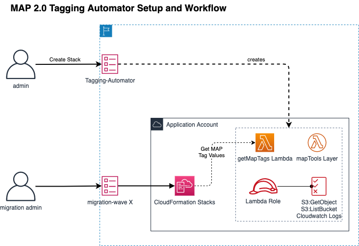

# MAP 2.0 Tagging Automator for CDK Deployment

This project is a CDK deployment of the MAP 2.0 tagging automator from [https://code.amazon.com/packages/Migration-automation-library/trees/mainline/--/cfn-map-tagger](https://code.amazon.com/packages/Migration-automation-library/trees/mainline/--/cfn-map-tagger)

MAP 2.0 customers that are using the CDK can now utilize this CDK version of the MAP 2.0 tagging automator to deploy and verify the solution.

## Architecture
This solution uses the CDK to deploy the MAP 2.0 tagging automator to a single AWS account. The architecture includes a Lambda function, Lambda layer, a Lambda execution role and custom policies. A diagram of the architecture is included below



## Deployment

**Prerequisite**  
A prerequisite to this installation is that you've installed the 2 other MAP 2.0 automation tools - CUR-Automator and Server-IDs Automator. Installation instructions can be found here: [https://s3-us-west-2.amazonaws.com/map-2.0-customer-documentation/tagging-instructions/MAP+Tagging+Instructions.pdf](https://s3-us-west-2.amazonaws.com/map-2.0-customer-documentation/tagging-instructions/MAP+Tagging+Instructions.pdf)

**Environment Setup**  
This project is set up like a standard Python project.  The initialization process also creates a virtualenv within this project, stored under the `.venv` directory.  To create the virtualenv it assumes that there is a `python3` (or `python` for Windows) executable in your path with access to he `venv` package. If for any reason the automatic creation of the virtualenv fails, you can create the virtualenv manually. 
To manually create a virtualenv on MacOS and Linux:

```
$ python3 -m venv .venv
```

After the init process completes and the virtualenv is created, you can use the following
step to activate your virtualenv.

```
$ source .venv/bin/activate
```

If you are a Windows platform, you would activate the virtualenv like this:

```
% .venv\Scripts\activate.bat
```

Once the virtualenv is activated, you can install the required dependencies.

```
$ cd MapTaggingAutomatorService
$ pip install -r requirements.txt
$ pip install -r resources/getMapTags/requirements.txt
$ pip install -r resources/mapTools/python/requirements.txt
```

At this point you can now synthesize the CloudFormation template for this code. 

```
$ cdk synth
```

**Testing Before Installing**
To test the solution locally using SAM follow these steps:

1. Ensure that you've already uploaded a server inventory file to the Server-IDs Automator S3 bucket.
2. Execute `cdk synth --no-staging > template.yaml` to generate a new template.yaml based on the solution.
3. Edit the `test-environment.json` file and set your Server-IDs Automator S3 bucket and region accordingly.  
*NOTE: The S3 bucket will be the one created in the prerequisites above during the Server IDs Automator installation.*
4. Edit the `test-lambda.json` file and set the appName parameter to an Application Name that was in your server inventory file.  
*NOTE: Again, the server inventory file was uploaded to the Server IDs Automator S3 bucket discussed above in the prerequisites.*
5. Open the template.yaml file and locate the logical ID for the lambda function. It will be similar to **MapTaggingAutomatorMAPTagLookupLambda0C98C498**
6. Ensure you set your AWS Profile to be a profile where the Server-IDs Automator is currently installed.
7. Execute the following command (edit the logical ID to be your logical ID):
```
sam local invoke MapTaggingAutomatorMAPTagLookupLambda0C98C498 -e test-lambda.json --env-vars test-environment.json
```

The last command will execute the lambda to look up the MAP tag values. Examine the output of the result for the `map-migration` and `map-migrated-app` tag values. If present, the lambda function was able to look up the appropriate tag values. Because of the nature of the tests, which uses the crhelper module, it will attempt to call back to a mock CFN url which will fail with "socket.gaierror: [Errorno -2] Name or service not known. Scrolling up through the output you will find that the Lambda function completed successfully and it is just the CFN callback to the mock URL that is failing.

**Installation**
To deploy the solution, ensure your environment is configured to your account using `aws configure`.

Next, execute `cdk synth`

Finally, execute `cdk deploy --parameters MapAutomatorMigrationHubInOutS3BucketName={BUCKET_NAME_HERE}` where {BUCKET_NAME_HERE} is the S3 bucket for the Server IDs automator.

Your Lambda function is now ready to be used to determine MAP 2.0 tag values. See [this repo](https://code.amazon.com/packages/Migration-automation-library/trees/mainline/--/cfn-map-tagger) for information on how to use the installed Lambda.